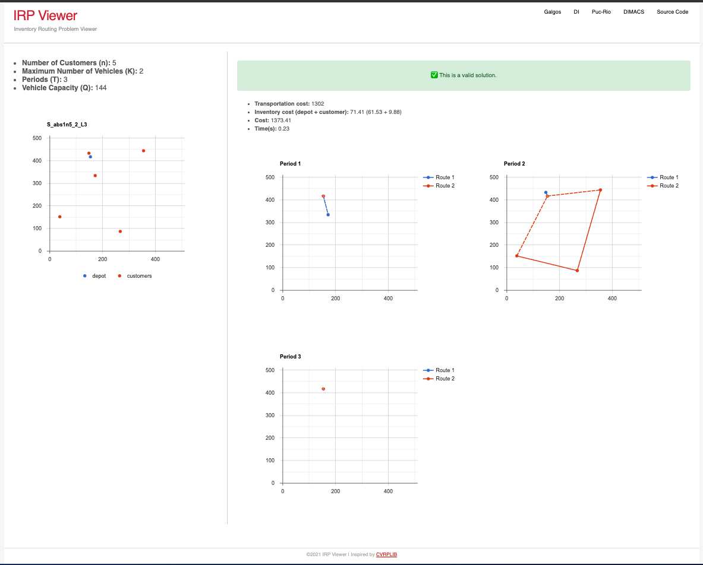

# IRP Viewer

It is a Web Application that allows view and validate a solution for the [DIMACAS-IRP challenge](http://dimacs.rutgers.edu/programs/challenge/vrp/irp/).

## Running with locally

You will need a common NodeJS environment with tools like

- node
- npm
- nvm

Then you can run from terminal:

    nvm install
    npm install
    npm test # just to check
    npm start

Now should be able to open [http://localhost:3000](http://localhost:3000).

## Running with Docker

If you are familiar with Docker, you can find a Dockerfile to build a Docker image for this application. 

To help, there are two Bash scripts that will build and run the container

    ./build.sh
    ./run.sh
